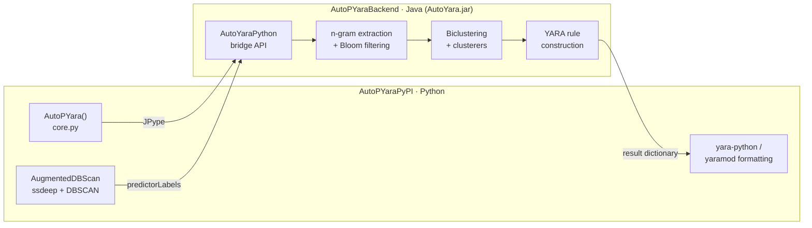
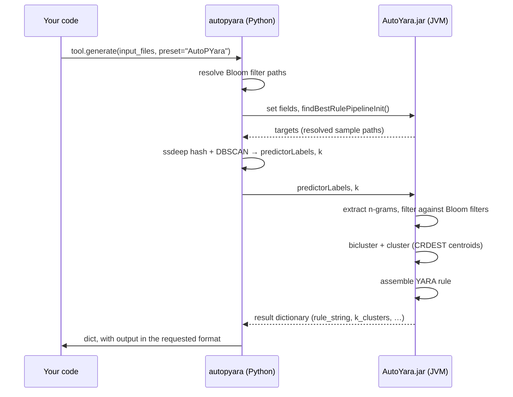
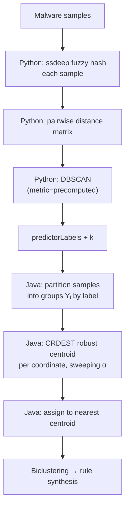
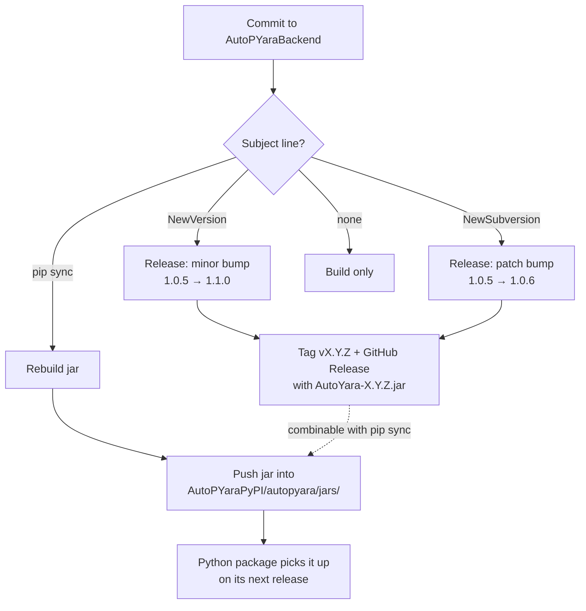

# Architecture

AutoPYara is **two separate projects** that ship as one tool. Understanding the split explains most of the design.

!!! info "The short version"
    The `autopyara` Python package you install from PyPI is a **frontend**. The clustering and rule-synthesis work happens inside a **Java backend** — a separate repository, [AutoPYaraBackend](https://github.com/Botacin-s-Lab/AutoPYaraBackend) — which is compiled into a jar and embedded in the Python package. Python drives it over [JPype](https://jpype.readthedocs.io/).

## The two repositories

| Repository | Language | Role | Ships as |
|---|---|---|---|
| [AutoPYaraPyPI](https://github.com/Botacin-s-Lab/AutoPYaraPyPI) | Python | Frontend: API, I/O, fuzzy-hash pre-clustering, output formatting | [`autopyara`](https://pypi.org/project/autopyara/) on PyPI |
| [AutoPYaraBackend](https://github.com/Botacin-s-Lab/AutoPYaraBackend) | Java 11 · Maven | Backend: n-gram extraction, Bloom filtering, biclustering, rule synthesis | `AutoYara.jar`, embedded in the above |



## Why it is split this way

The Java side inherits the heavy machinery from **AutoYara** (Raff et al., *"Automatic Yara Rule Generation Using Biclustering"*, AISec 2020) — byte n-gram counting at scale, counting Bloom filters, and biclustering-driven rule assembly. Reimplementing that in Python would be slower and pointless.

The Python side owns what is easier to express in Python: file handling, the ssdeep + DBSCAN pre-clustering that feeds the augmented clusterers, the preset system, and conversion of the resulting rule into `yara-python` or `yaramod` objects.

## End-to-end flow



Note the **round trip**: Python asks Java to load and extract candidates, pulls the resolved sample list back out, computes cluster labels itself, then hands those labels back to Java before the real run. That is the reason `findBestRulePipelineInit()` and `pythonRun()` are two separate calls rather than one.

## Inside the backend

Source: [`src/main/java/edu/lps/acs/ml/autoyara/`](https://github.com/Botacin-s-Lab/AutoPYaraBackend/tree/main/src/main/java/edu/lps/acs/ml/autoyara)

| Class | Role |
|---|---|
| [`AutoYaraPython`](https://github.com/Botacin-s-Lab/AutoPYaraBackend/blob/main/src/main/java/edu/lps/acs/ml/autoyara/AutoYaraPython.java) | The JPype-facing API — the only class Python touches |
| [`AutoYaraCluster`](https://github.com/Botacin-s-Lab/AutoPYaraBackend/blob/main/src/main/java/edu/lps/acs/ml/autoyara/AutoYaraCluster.java) | Original CLI entry point; `AutoYaraPython` extends it |
| [`Bytes2Bloom`](https://github.com/Botacin-s-Lab/AutoPYaraBackend/blob/main/src/main/java/edu/lps/acs/ml/autoyara/Bytes2Bloom.java) | Trains counting Bloom filters (exposed as `AutoPYara.train()`) |
| [`CountingBloom`](https://github.com/Botacin-s-Lab/AutoPYaraBackend/blob/main/src/main/java/edu/lps/acs/ml/autoyara/CountingBloom.java) | Counting Bloom filter implementation |
| [`SigCandidate`](https://github.com/Botacin-s-Lab/AutoPYaraBackend/blob/main/src/main/java/edu/lps/acs/ml/autoyara/SigCandidate.java) | A candidate n-gram signature and its statistics |
| [`YaraRuleContainerConjunctive`](https://github.com/Botacin-s-Lab/AutoPYaraBackend/blob/main/src/main/java/edu/lps/acs/ml/autoyara/YaraRuleContainerConjunctive.java) | Assembles and serializes the YARA rule |
| [`clustering/`](https://github.com/Botacin-s-Lab/AutoPYaraBackend/tree/main/src/main/java/edu/lps/acs/ml/autoyara/clustering) | Clustering strategies (see below) |

### Clustering algorithms

Set through the `cluster_alg` argument, or implied by your `preset`. An unrecognized value falls back to `VBGMM`.

| Algorithm | Needs `k` | Needs predictor labels | Assignment |
|---|:--:|:--:|---|
| `VBGMM` *(default)* | – | – | Hard; infers *k* |
| `KMeans` | ✔ | – | Hard |
| `KMeansSoft` | ✔ | – | Fuzzy |
| `Random` | ✔ | – | Hard (baseline) |
| `AugmentedKMeansDBSCAN` | ✔ | ✔ | Hard |
| `AugmentedKMeansVT` | ✔ | ✔ | Hard |
| `AugmentedKMeansDBSCANSoft` | ✔ | ✔ | Fuzzy |
| `AugmentedKMeansVTSoft` | ✔ | ✔ | Fuzzy |

The `preset="AutoYara"` shortcut selects `VBGMM`; `preset="AutoPYara"` selects `AugmentedKMeansDBSCANSoft`.

## The augmented pipeline

This is the part that spans both languages, and it is what `preset="AutoPYara"` actually does.



**CRDEST** ([`AugmentedKMeansClusterer`](https://github.com/Botacin-s-Lab/AutoPYaraBackend/blob/main/src/main/java/edu/lps/acs/ml/autoyara/clustering/AugmentedKMeansClusterer.java)) estimates each centroid coordinate in a way that resists corrupted or outlying values:

1. Randomly split the coordinate's values into halves `X₁` and `X₂`.
2. Find the shortest interval containing `m(1 − 5α)` points of `X₁`.
3. Average the `X₂` points that fall inside that interval (median fallback if none do).
4. Sweep the corruption parameter `α` from `0.01` to `0.15` and keep the centroid set with the lowest total assignment cost.

The intent is centroids that tolerate noise in the byte-signature feature space better than plain k-means, while borrowing family structure from the fuzzy-hash clustering.

!!! warning "Results are not bit-reproducible"
    The CRDEST split uses an unseeded random number generator, so repeated runs on identical inputs can produce different centroids and therefore different rules. Compare runs by rule quality, not by byte-for-byte equality.

## The Java ↔ Python bridge

`AutoYaraPython` is documented in-source as the **only** class JPype should touch, to keep the Python layer decoupled from backend internals.

```python
cluster = jpype.JPackage("edu.lps.acs.ml.autoyara").AutoYaraPython()
# ... set configuration fields ...
cluster.findBestRulePipelineInit()   # load inputs, extract candidates
result = cluster.pythonRun()         # returns the result dictionary
cluster.resetYaraState()             # clear state before reuse
```

The result dictionary carries `rule_string`, `k_clusters`, `strings`, `file_count`, `total_files`, `TP`, `TP_total`, `conditions_min`, `conditions_max`, `gram_size`, and `byte_candidate_count`. It is `None` when no rule satisfying the configured constraints could be built.

The JVM is started once per process, and its heap is currently fixed at 14 GB in [`interface.py`](https://github.com/Botacin-s-Lab/AutoPYaraPyPI/blob/main/autopyara/interface.py) — worth knowing if you are running on a memory-constrained machine.

## How the jar gets into the Python package

The two repositories release independently, and the jar is propagated on demand rather than automatically.



Backend jars are versioned semantically (`v1.0.0` onward) and published on the [backend Releases page](https://github.com/Botacin-s-Lab/AutoPYaraBackend/releases); each release records the commit it was built from. A `pip sync` commit updates **only** the jar in the Python repository — it does not rebuild or re-publish the `autopyara` package to PyPI. Full details are in the [backend README](https://github.com/Botacin-s-Lab/AutoPYaraBackend#continuous-integration-and-releases).

## Building the backend yourself

```bash
git clone https://github.com/Botacin-s-Lab/AutoPYaraBackend.git
cd AutoPYaraBackend
mvn -B package
```

This produces `target/AutoYara-<version>.jar`, a shaded fat jar with `Main-Class: edu.lps.acs.ml.autoyara.AutoYaraCluster`. To test it against the Python package, copy it over `autopyara/jars/AutoYara.jar` in your checkout. The backend can also be driven directly from the command line — see its README for the full option list.

## Credits

The backend builds on [AutoYara](https://github.com/FutureComputing4AI/AutoYara) by Raff et al. (*"Automatic Yara Rule Generation Using Biclustering"*, AISec 2020), which is released under the Apache License 2.0. It also depends on [JSAT](https://github.com/EdwardRaff/JSAT) for linear algebra and spectral co-clustering, and KiloGrams for large-scale n-gram extraction.
