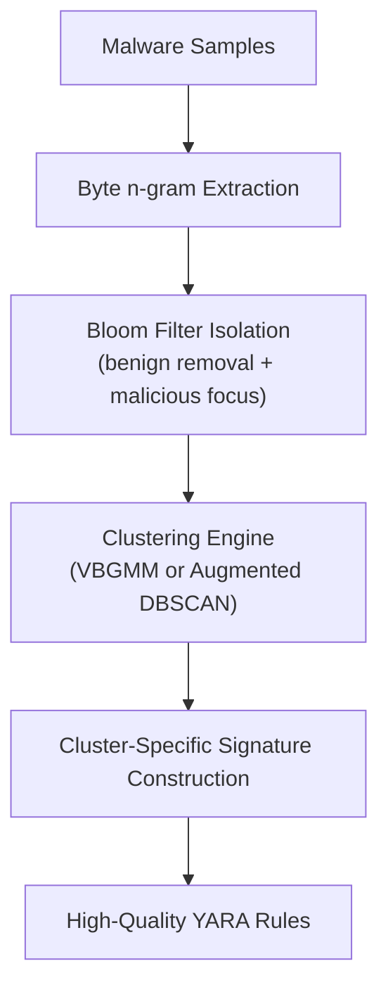

<div class="hero" markdown>

{ .hero-logo }

# AutoPYara

<p class="tagline">Automated, Cluster-Driven YARA Rule Generation</p>

[Get Started :material-arrow-right:](installation.md){ .md-button .md-button--primary }
[View on GitHub :fontawesome-brands-github:](https://github.com/Botacin-s-Lab/AutoPYaraPyPI){ .md-button }
[PyPI :fontawesome-brands-python:](https://pypi.org/project/autopyara/){ .md-button }

</div>

AutoPYara is a Python framework for automated YARA rule generation from collections of malware samples. It combines:

- Variational Bayesian Gaussian Mixture Models (VBGMM)
- Augmented DBSCAN with centroid refinement
- Malicious/benign Bloom filter isolation
- Byte-level n-gram feature extraction

The result: cluster-aware, precision-engineered YARA signatures with minimal manual effort.

!!! info "This site is a work in progress"
    This documentation is intentionally basic for now — installation, a quick start, and the full API reference. More material (including the accompanying paper, once published) will land here over time.

AutoPYara is [live on PyPI](https://pypi.org/project/autopyara/) — `pip install autopyara` to get started.

## How it works



## Features

<div class="feature-grid" markdown>

<div markdown>
### :material-cog-sync: Automated clustering
Group similar malware samples together automatically to create concise, targeted rules.
</div>

<div markdown>
### :material-swap-horizontal: Two core presets
The standard `AutoYara` (VBGMM) approach, or the enhanced `AutoPYara` (Augmented DBSCAN) pipeline.
</div>

<div markdown>
### :material-filter-variant: Built-in Bloom filters
Ships with pre-trained EMBER and AutoPYara filters to efficiently filter out benign n-grams.
</div>

<div markdown>
### :material-file-export: Multiple output formats
Raw strings, compiled `yara-python` objects, or `yaramod` parsed objects.
</div>

<div markdown>
### :material-school: Custom training
Train your own Bloom filters on proprietary datasets.
</div>

</div>

## Where to go next

- [Installation](installation.md) — requirements and how to install AutoPYara.
- [Quick Start](quickstart.md) — generate your first YARA rule.
- [API Reference](api.md) — presets, advanced usage, and the full `generate()` parameter table.
- [Architecture](architecture.md) — how the Python frontend and the separate Java backend fit together.
- [Development & Releasing](development.md) — running the tests and how releases are published.

## Project links

| | |
|---|---|
| :fontawesome-brands-python: **PyPI** | [pypi.org/project/autopyara](https://pypi.org/project/autopyara/) |
| :fontawesome-brands-github: **Python frontend** | [Botacin-s-Lab/AutoPYaraPyPI](https://github.com/Botacin-s-Lab/AutoPYaraPyPI) |
| :fontawesome-brands-java: **Java backend** | [Botacin-s-Lab/AutoPYaraBackend](https://github.com/Botacin-s-Lab/AutoPYaraBackend) — separate repository, builds the embedded `AutoYara.jar` |
| :material-bug: **Issues** | [Report a bug](https://github.com/Botacin-s-Lab/AutoPYaraPyPI/issues) |

## Citation

If you use AutoPYara in academic work, please cite:

> Mabon Ninan\*, Nhat Minh Nguyen\*, Soumyajyoti Dutta, Sidharth Anil, and Marcus Botacin.
> **"AutoPYara: Next-Gen YARA Rule Generator for Malware Family Clustering."** *Annual Computer Security Applications Conference (ACSAC 2026)*, to appear.
> \*Equal contribution. Texas A&M University — {ninanmm, nmnguy29, soumyajyoti1998, sid.anil, botacin}@tamu.edu

```bibtex
@inproceedings{autopyara2026,
  title     = {AutoPYara: Next-Gen YARA Rule Generator for Malware Family Clustering},
  author    = {Ninan, Mabon and Nguyen, Nhat Minh and Dutta, Soumyajyoti and Anil, Sidharth and Botacin, Marcus},
  booktitle = {Proceedings of the Annual Computer Security Applications Conference (ACSAC)},
  year      = {2026},
  note      = {To appear}
}
```

AutoPYara's Python frontend was also the subject of a related thesis:

> Nhat Minh Nguyen. **"AutoPYara: A Python/Java Framework for Automatic YARA Rule Generation Using Semi-Supervised Clustering."** M.S. Thesis, Texas A&M University, Spring 2025.

The `AutoYara` preset builds on the original AutoYara project — please also cite its paper; see [Architecture → Credits](architecture.md#credits).
