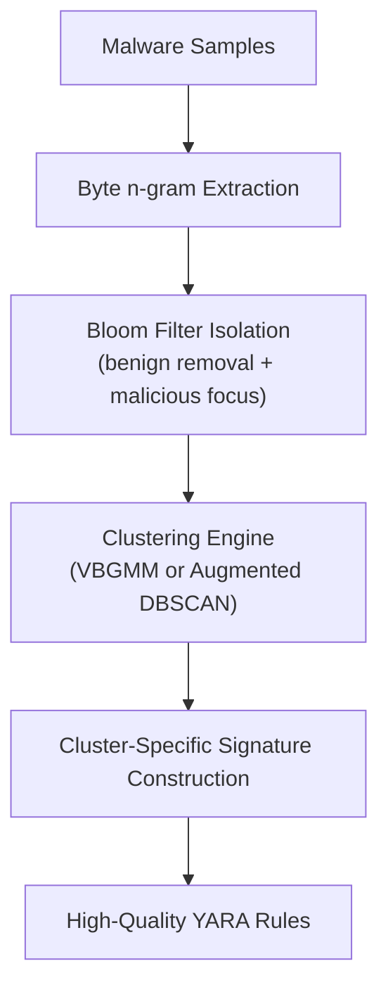

# AutoPYara

**Automated, Cluster-Driven YARA Rule Generation**

AutoPYara is a Python framework for automated YARA rule generation from collections of malware samples. It combines:

- Variational Bayesian Gaussian Mixture Models (VBGMM)
- Augmented DBSCAN with centroid refinement
- Malicious/benign Bloom filter isolation
- Byte-level n-gram feature extraction

The result: cluster-aware, precision-engineered YARA signatures with minimal manual effort.

!!! info "This site is a work in progress"
    This documentation is intentionally basic for now — installation, a quick start, and the full API reference. More material (including the accompanying paper, once published) will land here over time.

## How it works

## Features

- **Automated clustering** — group similar malware samples together automatically to create concise, targeted rules.
- **Two core presets** — the standard `AutoYara` (VBGMM) approach, or the enhanced `AutoPYara` (Augmented DBSCAN) pipeline.
- **Built-in Bloom filters** — ships with pre-trained EMBER and AutoPYara filters to efficiently filter out benign n-grams.
- **Multiple output formats** — raw strings, compiled `yara-python` objects, or `yaramod` parsed objects.
- **Custom training** — train your own Bloom filters on proprietary datasets.

## Where to go next

- [Installation](installation.md) — requirements and how to install AutoPYara.
- [Quick Start](quickstart.md) — generate your first YARA rule.
- [API Reference](api.md) — presets, advanced usage, and the full `generate()` parameter table.
- [Development & Releasing](development.md) — running the tests and how releases are published.

## Links

- [PyPI project](https://pypi.org/project/autopyara/)
- [Source code](https://github.com/Botacin-s-Lab/AutoPYaraPyPI)
- [Issue tracker](https://github.com/Botacin-s-Lab/AutoPYaraPyPI/issues)
