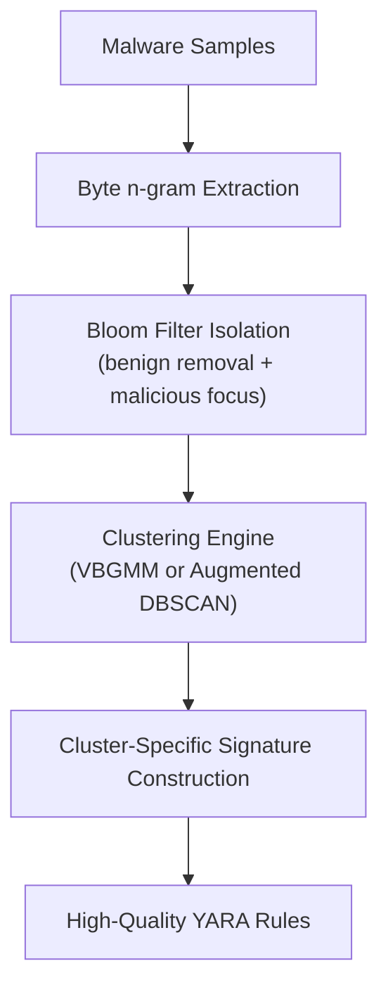

{ .hero-logo }

# AutoPYara

Automated, Cluster-Driven YARA Rule Generation

[Get Started :material-arrow-right:](installation.md){ .md-button .md-button--primary }
[View on GitHub :fontawesome-brands-github:](https://github.com/Botacin-s-Lab/AutoPYaraPyPI){ .md-button }
[PyPI :fontawesome-brands-python:](https://pypi.org/project/autopyara/){ .md-button }

AutoPYara is a Python framework for automated YARA rule generation from collections of malware samples. It combines:

- Variational Bayesian Gaussian Mixture Models (VBGMM)
- Augmented DBSCAN with centroid refinement
- Malicious/benign Bloom filter isolation
- Byte-level n-gram feature extraction

The result: cluster-aware, precision-engineered YARA signatures with minimal manual effort.

!!! info "This site is a work in progress"
    This documentation is intentionally basic for now — installation, a quick start, and the full API reference. More material (including the accompanying paper, once published) will land here over time.

AutoPYara is [live on PyPI](https://pypi.org/project/autopyara/) — `pip install autopyara` to get started.

## How it works

## Features

### :material-cog-sync: Automated clustering
Group similar malware samples together automatically to create concise, targeted rules.

### :material-swap-horizontal: Two core presets
The standard `AutoYara` (VBGMM) approach, or the enhanced `AutoPYara` (Augmented DBSCAN) pipeline.

### :material-filter-variant: Built-in Bloom filters
Ships with pre-trained EMBER and AutoPYara filters to efficiently filter out benign n-grams.

### :material-file-export: Multiple output formats
Raw strings, compiled `yara-python` objects, or `yaramod` parsed objects.

### :material-school: Custom training
Train your own Bloom filters on proprietary datasets.

## Where to go next

- [Installation](installation.md) — requirements and how to install AutoPYara.
- [Quick Start](quickstart.md) — generate your first YARA rule.
- [API Reference](api.md) — presets, advanced usage, and the full `generate()` parameter table.
- [Development & Releasing](development.md) — running the tests and how releases are published.
