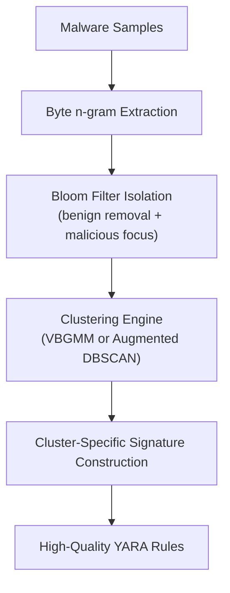

<div class="hero" markdown>

{ .hero-logo }

# AutoPYara

<p class="tagline">Automated, Cluster-Driven YARA Rule Generation</p>

[Get Started :material-arrow-right:](installation.md){ .md-button .md-button--primary }
[View on GitHub :fontawesome-brands-github:](https://github.com/Botacin-s-Lab/AutoPYaraPyPI){ .md-button }
[PyPI :fontawesome-brands-python:](https://pypi.org/project/autopyara/){ .md-button }

</div>

AutoPYara is a Python framework for automated YARA rule generation from collections of malware samples. It combines:

- Variational Bayesian Gaussian Mixture Models (VBGMM)
- Augmented DBSCAN with centroid refinement
- Malicious/benign Bloom filter isolation
- Byte-level n-gram feature extraction

The result: cluster-aware, precision-engineered YARA signatures with minimal manual effort.

!!! success "Accepted at ACSAC 2026"
    The AutoPYara paper will appear at the *Annual Computer Security Applications Conference (ACSAC), 2026*. [Read the paper →](paper.md)

AutoPYara is [live on PyPI](https://pypi.org/project/autopyara/) — `pip install autopyara` to get started.

## How it works


```mermaid
flowchart TD
    A[Malware Samples] --> B[Byte n-gram Extraction]
    B --> C["Bloom Filter Isolation<br/>(benign removal + malicious focus)"]
    C --> D["Clustering Engine<br/>(VBGMM or Augmented DBSCAN)"]
    D --> E[Cluster-Specific Signature Construction]
    E --> F[High-Quality YARA Rules]
```

## Features

<div class="feature-grid" markdown>

<div markdown>
### :material-cog-sync: Automated clustering
Group similar malware samples together automatically to create concise, targeted rules.
</div>

<div markdown>
### :material-swap-horizontal: Two core presets
The standard `AutoYara` (VBGMM) approach, or the enhanced `AutoPYara` (Augmented DBSCAN) pipeline.
</div>

<div markdown>
### :material-filter-variant: Built-in Bloom filters
Ships with pre-trained EMBER and AutoPYara filters to efficiently filter out benign n-grams.
</div>

<div markdown>
### :material-file-export: Multiple output formats
Raw strings, compiled `yara-python` objects, or `yaramod` parsed objects.
</div>

<div markdown>
### :material-school: Custom training
Train your own Bloom filters on proprietary datasets.
</div>

</div>

## Where to go next

- [Installation](installation.md) — requirements and how to install AutoPYara.
- [Quick Start](quickstart.md) — generate your first YARA rule.
- [API Reference](api.md) — presets, advanced usage, and the full `generate()` parameter table.
- [Architecture](architecture.md) — how the Python frontend and the separate Java backend fit together.
- [Paper & Resources](paper.md) — the ACSAC 2026 paper (PDF), abstract, citation, and artifacts.
- [Development & Releasing](development.md) — running the tests and how releases are published.

## Project links

| | |
|---|---|
| :material-archive: **ACSAC permanent artifact** | [Zenodo — zenodo.org/records/23107801](https://zenodo.org/records/23107801) |
| :fontawesome-brands-github: **ACSAC artifact source** | [GitHub — Botacin-s-Lab/AutoPYara](https://github.com/Botacin-s-Lab/AutoPYara/) |
| :material-book-open-variant: **API documentation** | [GitHub Pages — botacin-s-lab.github.io/AutoPYaraPyPI](https://botacin-s-lab.github.io/AutoPYaraPyPI/) |
| :fontawesome-brands-github: **PyPI source repository** | [GitHub — Botacin-s-Lab/AutoPYaraPyPI](https://github.com/Botacin-s-Lab/AutoPYaraPyPI) |
| :fontawesome-brands-java: **Java backend engine** | [GitHub — Botacin-s-Lab/AutoPYaraBackend](https://github.com/Botacin-s-Lab/AutoPYaraBackend) |
| :material-database: **YARA rules & benchmark data** | [Zenodo — zenodo.org/records/22665898](https://zenodo.org/records/22665898) |
| :fontawesome-brands-python: **Python package** (`pip install autopyara`) | [PyPI — pypi.org/project/autopyara](https://pypi.org/project/autopyara/) |
| :material-file-pdf-box: **Paper (PDF)** | [AutoPYara_ACSAC2026.pdf](paper/AutoPYara_ACSAC2026.pdf) |
| :material-bug: **Issues** | [Report a bug](https://github.com/Botacin-s-Lab/AutoPYaraPyPI/issues) |

## Citation

If you use AutoPYara in academic work, please cite the ACSAC 2026 paper ([PDF](paper/AutoPYara_ACSAC2026.pdf)). Recommended citation:

> Mabon Ninan\*, Nhat Minh Nguyen\*, Soumyajyoti Dutta, Sidharth Anil, and Marcus Botacin.
> **"AutoPYara: Next-Gen YARA Rule Generator for Malware Family Clustering."** *Annual Computer Security Applications Conference (ACSAC)*, 2026.
> \*Equal contribution. Texas A&M University — {ninanmm, nmnguy29, soumyajyoti1998, sid.anil, botacin}@tamu.edu

```bibtex
@inproceedings{autopyara2026,
  title     = {AutoPYara: Next-Gen YARA Rule Generator for Malware Family Clustering},
  author    = {Ninan, Mabon and Nguyen, Nhat Minh and Dutta, Soumyajyoti and Anil, Sidharth and Botacin, Marcus},
  booktitle = {Annual Computer Security Applications Conference (ACSAC)},
  year      = {2026}
}
```

AutoPYara's Python frontend was also the subject of a related thesis:

> Nhat Minh Nguyen. **"AutoPYara: A Python/Java Framework for Automatic YARA Rule Generation Using Semi-Supervised Clustering."** M.S. Thesis, Texas A&M University, Spring 2025.

The `AutoYara` preset builds on the original AutoYara project — please also cite its paper; see [Architecture → Credits](architecture.md#credits).
